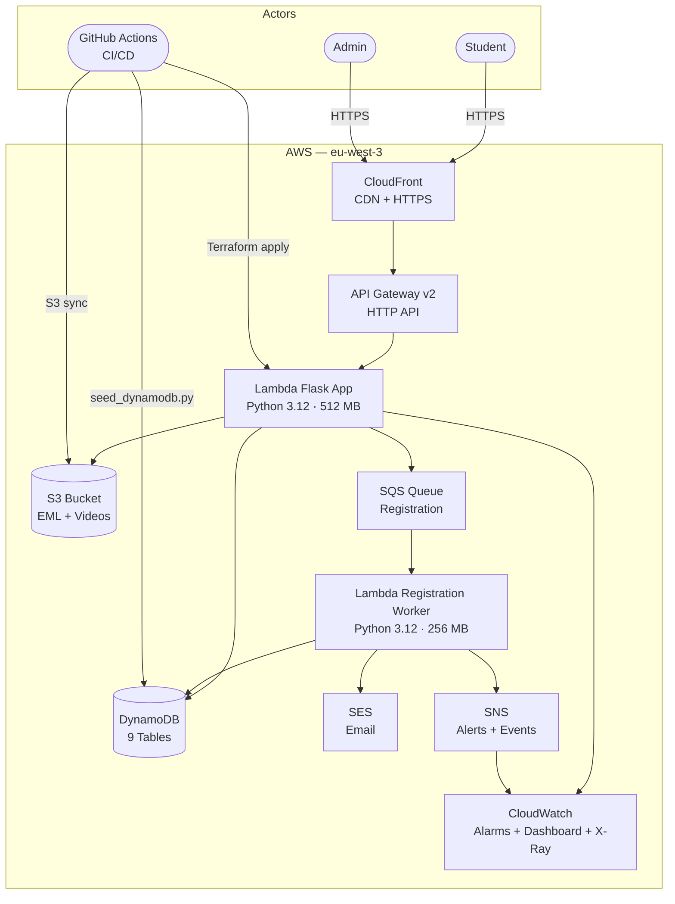
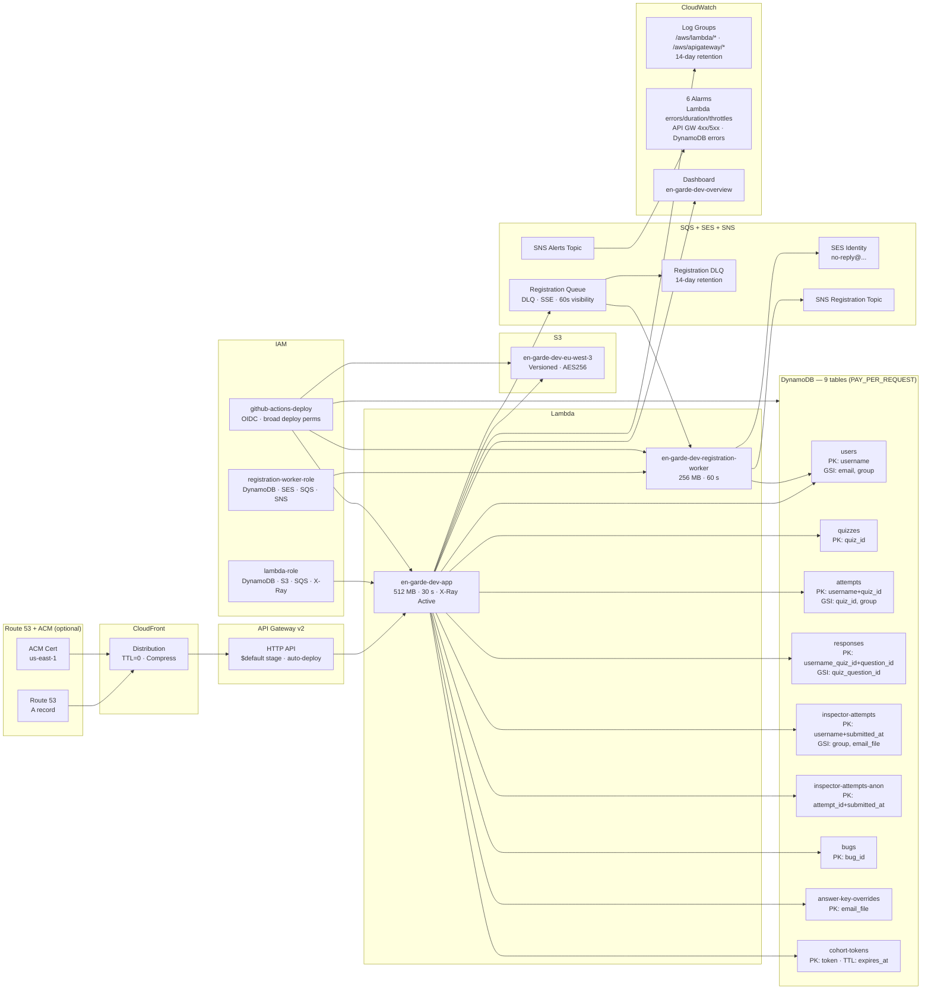
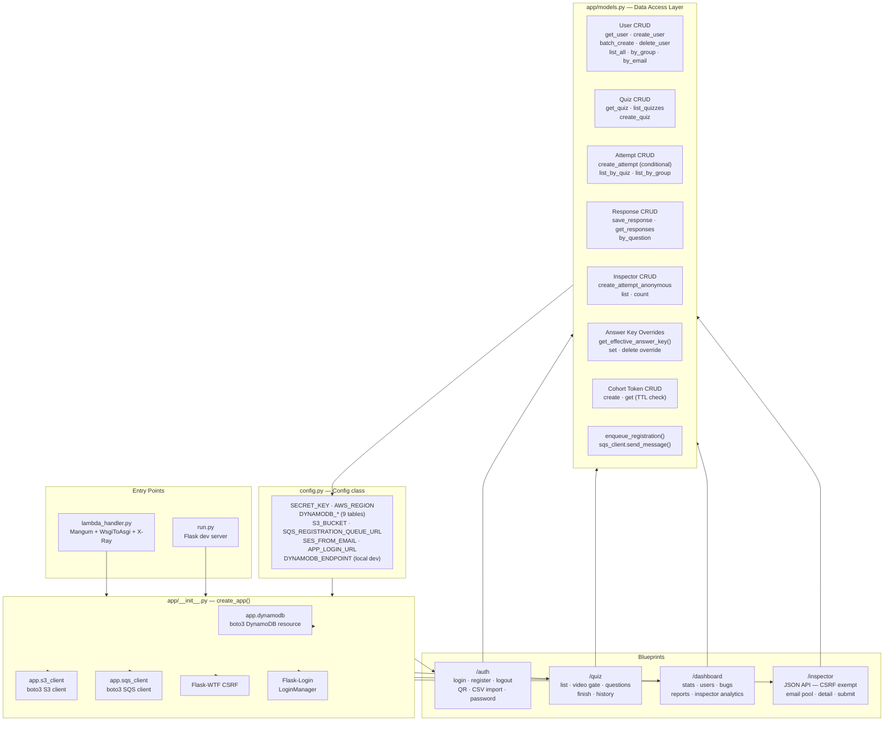
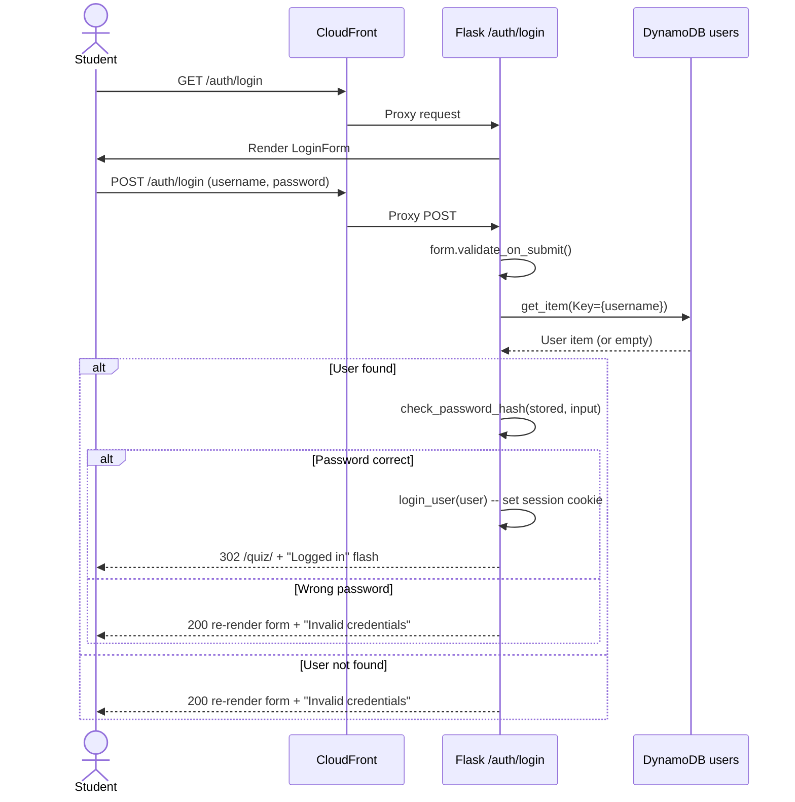
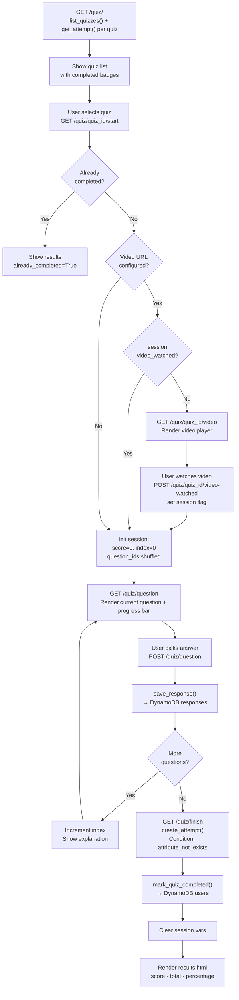
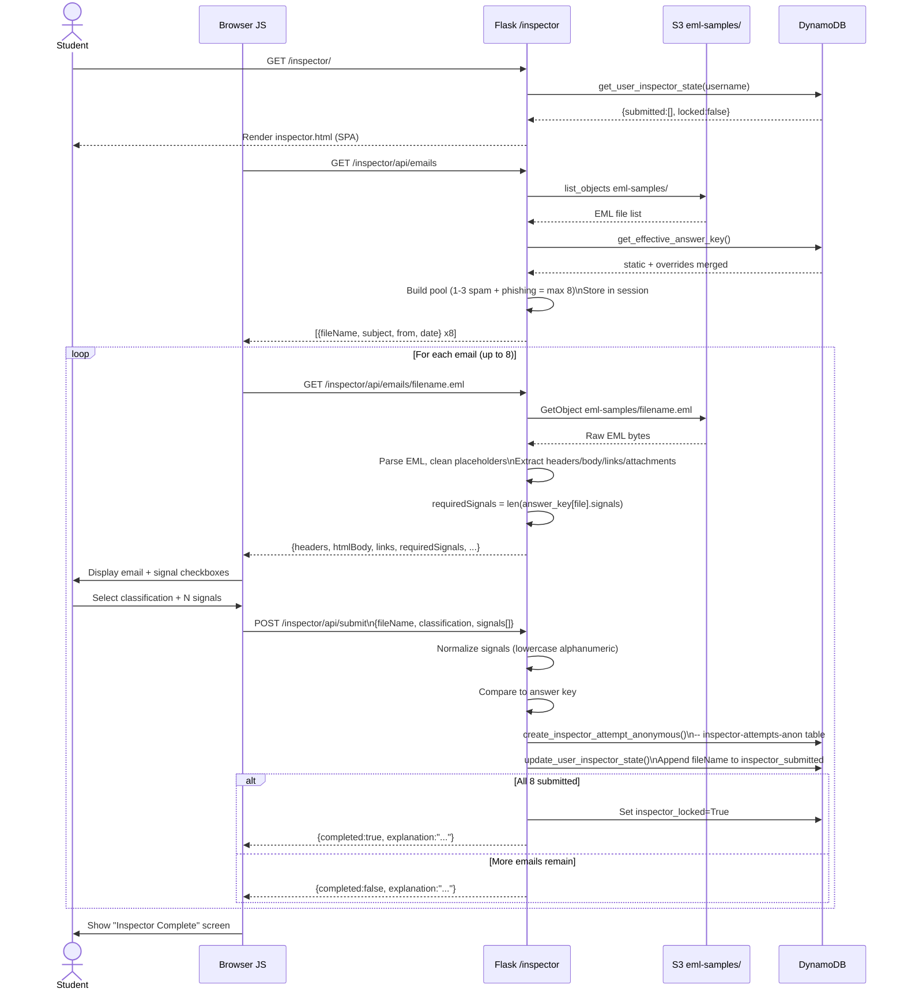
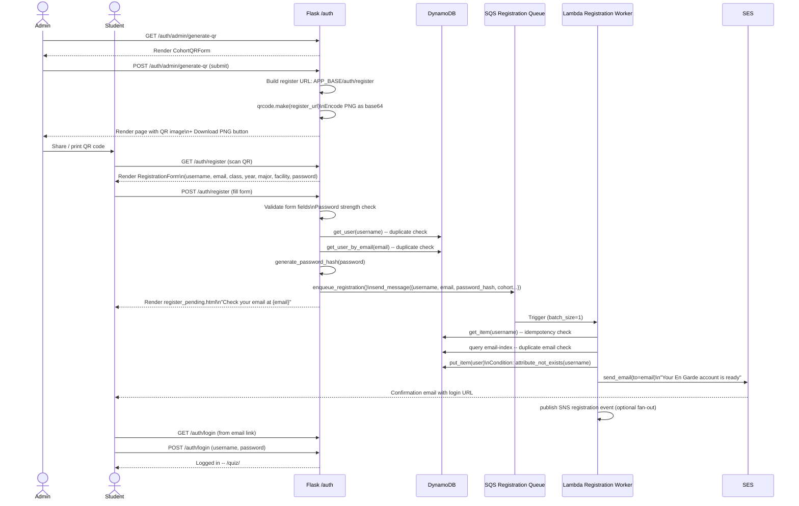
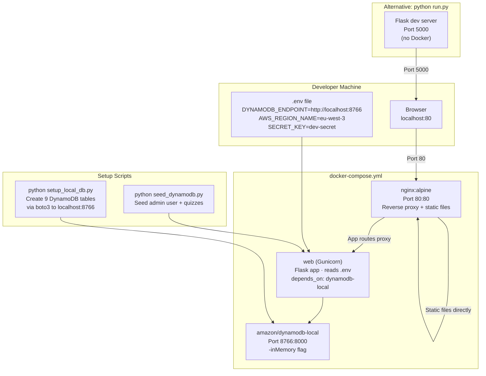

# Architecture Diagrams

> Phishing awareness training application — En Garde
> See also: [REQUIREMENTS.md](REQUIREMENTS.md) | [README](../README.md)

## Table of Contents

1. [System Overview](#1-system-overview)
2. [AWS Infrastructure](#2-aws-infrastructure)
3. [Flask Software Architecture](#3-flask-software-architecture)
4. [DynamoDB Schema](#4-dynamodb-schema)
5. [CI/CD Pipeline](#5-cicd-pipeline)
6. [Login Flow](#6-login-flow)
7. [Quiz Flow](#7-quiz-flow)
8. [Email Inspector Flow](#8-email-inspector-flow)
9. [QR Self-Registration Flow](#9-qr-self-registration-flow)
10. [Local Development Architecture](#10-local-development-architecture)

---

## 1. System Overview

High-level C4-style context diagram: all actors and AWS services in one view.



---

## 2. AWS Infrastructure

All resources grouped by AWS service with connection direction.



---

## 3. Flask Software Architecture

App factory, blueprints, models, and DynamoDB table mapping.



---

## 4. DynamoDB Schema

All 9 tables, primary keys, sort keys, and GSIs.

```mermaid
erDiagram
    USERS {
        string username PK
        string email GSI-email-index
        string group GSI-group-index
        string password_hash
        bool is_admin
        bool quiz_completed
        string class_name
        string academic_year
        string major
        string facility
        string created_at
        list inspector_submitted
        bool inspector_locked
    }

    QUIZZES {
        string quiz_id PK
        string title
        string description
        list questions
        string video_url
        string created_at
    }

    ATTEMPTS {
        string username PK
        string quiz_id SK
        string group GSI-group-index
        string completed_at GSI-quiz-index-range
        number score
        number total
        number percentage
        string class_name
        string academic_year
        string major
    }

    RESPONSES {
        string username_quiz_id PK
        string question_id SK
        string quiz_question_id GSI-quiz-question-index
        string username GSI-quiz-question-index-range
        string selected_answer_id
        bool is_correct
        string answered_at
    }

    INSPECTOR_ATTEMPTS {
        string username PK
        string submitted_at SK
        string group GSI-group-index
        string email_file GSI-email-index
        string classification
        list selected_signals
        string expected_classification
        list expected_signals
        bool is_correct
        string class_name
        string academic_year
        string major
    }

    INSPECTOR_ATTEMPTS_ANON {
        string attempt_id PK
        string submitted_at SK
        string email_file
        string classification
        list selected_signals
        bool is_correct
        string class_name
        string academic_year
        string major
    }

    BUGS {
        string bug_id PK
        string username
        string description
        string page_url
        string status
        string submitted_at
    }

    ANSWER_KEY_OVERRIDES {
        string email_file PK
        string classification
        list signals
        string explanation
    }

    COHORT_TOKENS {
        string token PK
        string class_name
        string academic_year
        string major
        string facility
        string created_by
        string created_at
        number expires_at
    }

    USERS ||--o{ ATTEMPTS : "has"
    USERS ||--o{ RESPONSES : "submits"
    USERS ||--o{ INSPECTOR_ATTEMPTS : "classifies"
    QUIZZES ||--o{ ATTEMPTS : "scored_in"
    QUIZZES ||--o{ RESPONSES : "answered_in"
```

---

## 5. CI/CD Pipeline

Full GitHub Actions pipeline: push to main triggers CI, then deploy to dev.

```mermaid
flowchart TD
    Push["git push to main"] --> CIJob

    subgraph CIJob["ci.yml — CI Job"]
        Lint["make lint\nflake8 app/ --max-line-length=120"]
        Test["make test\npytest tests/ + moto AWS mocks\nJUnit XML report"]
        Lint --> Test
    end

    CIJob --> DeployJob

    subgraph DeployJob["deploy-dev.yml — Deploy Job\n(env: dev · OIDC role)"]
        PipInst["pip install -r requirements.txt"]
        TFSetup["Setup Terraform ~1.9"]
        AWSAuth["AWS OIDC Auth\nsecrets.AWS_DEPLOY_ROLE_ARN"]
        BuildLambda["make lambda\n→ lambda.zip"]
        VerifyZip["test -f lambda.zip"]
        TFInit["terraform init -reconfigure\n-backend-config=backend/dev.hcl"]
        TFVal["terraform validate"]
        WriteTFVars["Write env/dev.tfvars\nregion · env · app_name · secret_key"]
        TFPlan["terraform plan\n-var-file=env/dev.tfvars -out=tfplan"]
        TFApply["terraform apply\n-auto-approve tfplan"]
        CaptureOutputs["Capture tf outputs\ns3_bucket · cloudfront_url\nall DynamoDB table names"]
        SyncEML["aws s3 sync examples/\n→ s3://bucket/eml-samples/"]
        SyncVideos["aws s3 sync app/static/videos/\n→ s3://bucket/videos/"]
        SeedDB["python3 seed_dynamodb.py\n(if not skip_seed)"]
        Summary["Post Job Summary\nApp URL · CloudFront URL"]

        PipInst --> TFSetup --> AWSAuth --> BuildLambda --> VerifyZip
        VerifyZip --> TFInit --> TFVal --> WriteTFVars --> TFPlan --> TFApply
        TFApply --> CaptureOutputs --> SyncEML --> SyncVideos --> SeedDB --> Summary
    end

    subgraph ExtraWF["Other Workflows"]
        ClaudeAction["claude.yml\n@claude mentions in Issues/PRs"]
        ClaudeReview["claude-code-review.yml\nAuto PR review on every PR"]
    end
```



---

## 6. Login Flow



---

## 7. Quiz Flow



---

## 8. Email Inspector Flow



---

## 9. QR Self-Registration Flow



---

## 10. Local Development Architecture


