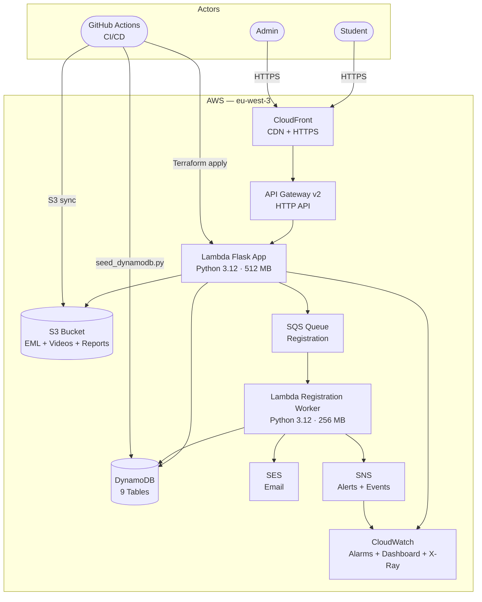
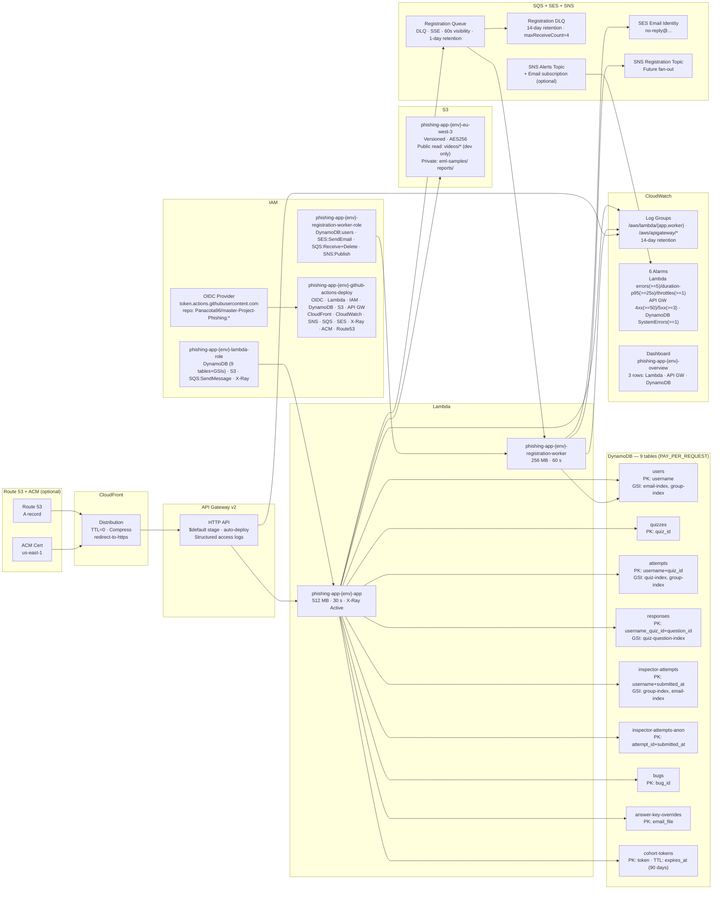
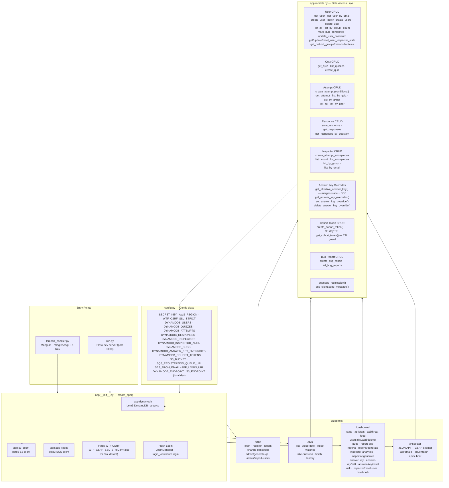
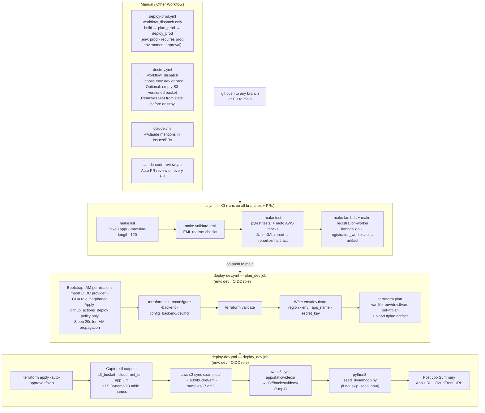
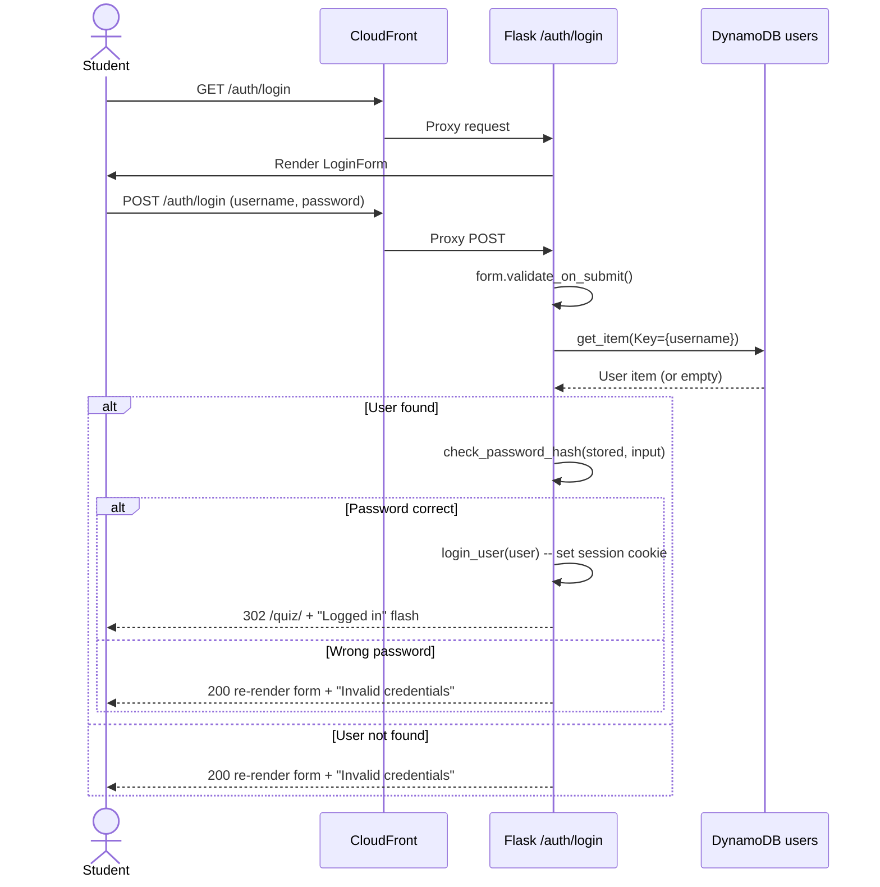
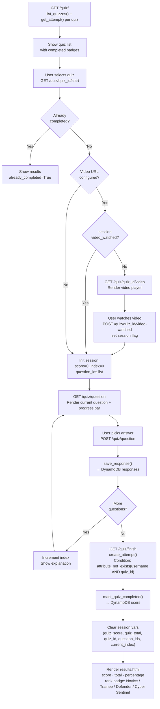
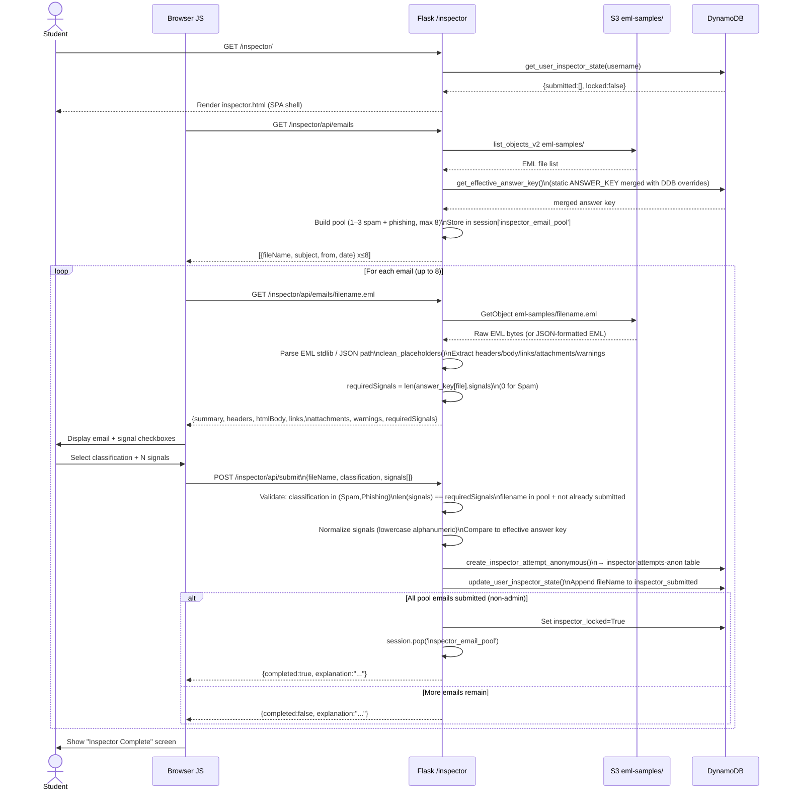
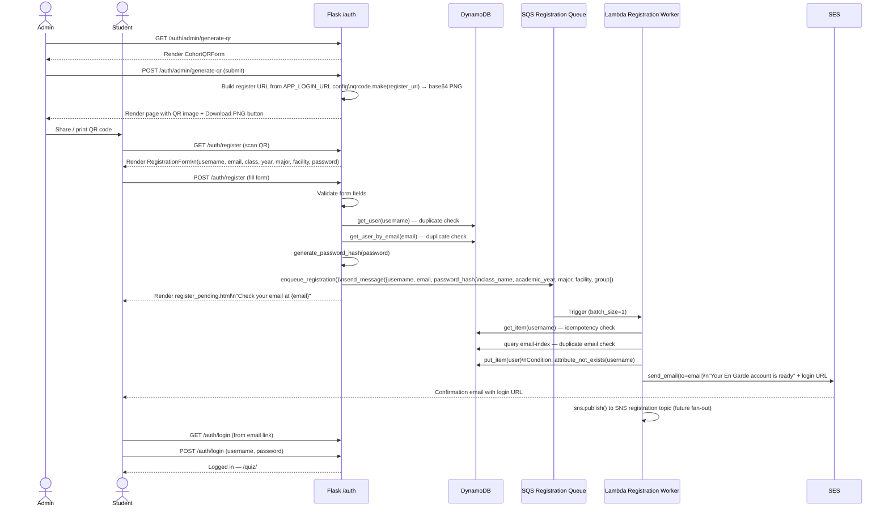
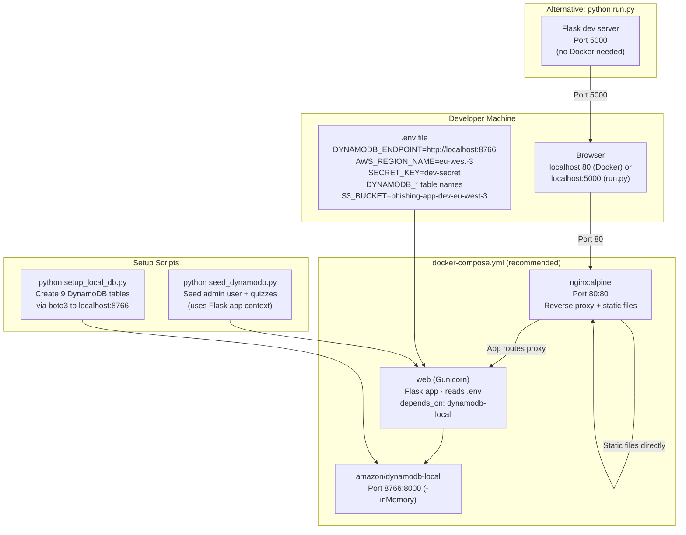

# Architecture Diagrams

> Phishing awareness training application
> See also: [REQUIREMENTS.md](REQUIREMENTS.md) | [README](../README.md)

## Table of Contents

1. [System Overview](#1-system-overview)
2. [AWS Infrastructure](#2-aws-infrastructure)
3. [Flask Software Architecture](#3-flask-software-architecture)
4. [DynamoDB Schema](#4-dynamodb-schema)
5. [CI/CD Pipeline](#5-cicd-pipeline)
6. [Login Flow](#6-login-flow)
7. [Quiz Flow](#7-quiz-flow)
8. [Email Inspector Flow](#8-email-inspector-flow)
9. [QR Self-Registration Flow](#9-qr-self-registration-flow)
10. [Local Development Architecture](#10-local-development-architecture)

---

## 1. System Overview

High-level C4-style context diagram: all actors and AWS services in one view.



---

## 2. AWS Infrastructure


All resources grouped by AWS service with connection direction.



---

## 3. Flask Software Architecture

App factory, blueprints, models, and DynamoDB table mapping.



### Blueprint Routing Table

| Blueprint | Prefix | Key Routes |
|-----------|--------|------------|
| `app/auth` | `/auth` | `GET/POST /auth/login`, `GET /auth/logout`, `GET/POST /auth/register`, `GET/POST /auth/change-password`, `GET/POST /auth/admin/generate-qr`, `GET/POST /auth/admin/import-users` |
| `app/quiz` | `/quiz` | `GET /quiz/`, `GET /quiz/<id>/start`, `GET /quiz/<id>/video`, `POST /quiz/<id>/video-watched`, `GET/POST /quiz/question`, `GET /quiz/finish`, `GET /quiz/history` |
| `app/dashboard` | `/dashboard` | `GET /dashboard/`, `GET /dashboard/api/stats`, `GET /dashboard/api/threat-feed`, `GET /dashboard/users`, `POST /dashboard/users/add`, `POST /dashboard/users/delete/<u>`, `GET /dashboard/bugs`, `POST /dashboard/report-bug`, `GET /dashboard/risk`, `GET /dashboard/reports`, `POST /dashboard/reports/generate`, `GET /dashboard/inspector`, `POST /dashboard/reports/inspector/generate`, `GET /dashboard/inspector/answer-key`, `POST /dashboard/inspector/answer-key/edit`, `POST /dashboard/inspector/answer-key/reset`, `POST /dashboard/inspector/reset-user`, `POST /dashboard/inspector/reset-bulk` |
| `app/inspector` | `/inspector` | `GET /inspector/`, `GET /inspector/api/emails`, `GET /inspector/api/emails/<filename>`, `POST /inspector/api/submit` |

---

## 4. DynamoDB Schema

All 9 tables, primary keys, sort keys, and GSIs.

```mermaid
erDiagram
    USERS {
        string username PK
        string email GSI-email-index
        string group GSI-group-index
        string password_hash
        bool is_admin
        bool quiz_completed
        string class_name
        string academic_year
        string major
        string facility
        string created_at
        list inspector_submitted
        bool inspector_locked
    }

    QUIZZES {
        string quiz_id PK
        string title
        string description
        list questions
        string video_url
        string created_at
    }

    ATTEMPTS {
        string username PK
        string quiz_id SK
        string group GSI-group-index
        string completed_at GSI-quiz-index-SK
        number score
        number total
        number percentage
        string class_name
        string academic_year
        string major
    }

    RESPONSES {
        string username_quiz_id PK
        string question_id SK
        string quiz_question_id GSI-quiz-question-index
        string username GSI-quiz-question-index-SK
        string selected_answer_id
        bool is_correct
        string answered_at
    }

    INSPECTOR_ATTEMPTS {
        string username PK
        string submitted_at SK
        string group GSI-group-index
        string email_file GSI-email-index
        string classification
        list selected_signals
        string expected_classification
        list expected_signals
        bool is_correct
        string class_name
        string academic_year
        string major
    }

    INSPECTOR_ATTEMPTS_ANON {
        string attempt_id PK
        string submitted_at SK
        string email_file
        string classification
        list selected_signals
        string expected_classification
        list expected_signals
        bool is_correct
        string class_name
        string academic_year
        string major
    }

    BUGS {
        string bug_id PK
        string username
        string description
        string page_url
        string status
        string submitted_at
    }

    ANSWER_KEY_OVERRIDES {
        string email_file PK
        string classification
        list signals
        string explanation
    }

    COHORT_TOKENS {
        string token PK
        string class_name
        string academic_year
        string major
        string facility
        string created_by
        string created_at
        number expires_at
    }

    USERS ||--o{ ATTEMPTS : "has"
    USERS ||--o{ RESPONSES : "submits"
    USERS ||--o{ INSPECTOR_ATTEMPTS : "classifies"
    QUIZZES ||--o{ ATTEMPTS : "scored_in"
    QUIZZES ||--o{ RESPONSES : "answered_in"
```

---

## 5. CI/CD Pipeline


Full GitHub Actions pipeline across all workflow files.



---

## 6. Login Flow



---

## 7. Quiz Flow



---

## 8. Email Inspector Flow



---

## 9. QR Self-Registration Flow



---

## 10. Local Development Architecture


