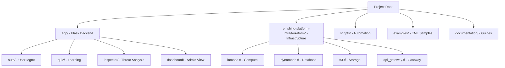

# Phishing Awareness Training - Documentation Suite

Welcome to the documentation for the Phishing Awareness Training Application. This repository uses `documentation/WORKBOARD.md` as the live backlog and governance index, while the rest of this folder stays focused on architecture, setup, operations, and user guidance.

## Project Overview

## Documentation Structure

### 📌 [Workboard](WORKBOARD.md)
Live source of truth for milestones, initiative issues, confirmed bugs, and branch naming conventions.

### 🛠️ [Developer Guides](dev/README.md)
For software engineers contributing to the codebase.
- **Architecture**: Blueprints, models, and data flow.
- **Setup**: Local environment and database seeding.
- **Contributing**: Coding standards and testing.

### 🚀 [Operator Guides](operator/README.md)
For DevOps engineers and system administrators managing the infrastructure.
- **Infrastructure**: AWS resource mapping and Terraform.
- **CI/CD**: GitHub Actions pipeline and environment management.
- **Deployment**: Lambda packaging and Terraform deployment.
- **Maintenance**: Backups, migrations, and troubleshooting.

### 🎓 [User Guides](user/README.md)
For end-users, students, and administrators using the platform.
- **Student Guide**: Taking quizzes and using the Email Threat Inspector.
- **Admin Guide**: User management, analytics, and reporting.

### ⚖️ [Compliance & Security Frameworks](COMPLIANCE_FRAMEWORKS.md)
Detailed report on GDPR compliance, NIST CSF 2.0 alignment, OWASP Top 10 mitigation, and SOC 2 principles.

### 📋 [Audit & Roadmap](AUDIT_AND_ROADMAP.md)
Comprehensive feature audit and strategic roadmap for future project enhancements.

### 🗂️ [Repository Separation Guide](REPO_SEPARATION.md)
Strategy and step-by-step instructions for splitting the Flask application and AWS infrastructure into two standalone repositories.

---
*Generated by Gemini CLI `software-project-documenter` skill.*
