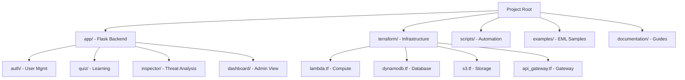

# Phishing Awareness Training - Documentation Suite

Welcome to the documentation for the Phishing Awareness Training Application. This project is a Flask-based web application deployed on AWS using a serverless architecture (Lambda + API Gateway + DynamoDB).

## Project Overview

## Documentation Structure

### 🛠️ [Developer Guides](dev/README.md)
For software engineers contributing to the codebase.
- **Architecture**: Blueprints, models, and data flow.
- **Setup**: Local environment and database seeding.
- **Contributing**: Coding standards and testing.

### 🚀 [Operator Guides](operator/README.md)
For DevOps engineers and system administrators managing the infrastructure.
- **Infrastructure**: AWS resource mapping and Terraform.
- **CI/CD**: GitLab CI pipeline and environment management.
- **Deployment**: Lambda packaging and Terraform deployment.
- **Maintenance**: Backups, migrations, and troubleshooting.

### 🎓 [User Guides](user/README.md)
For end-users, students, and administrators using the platform.
- **Student Guide**: Taking quizzes and using the Email Threat Inspector.
- **Admin Guide**: User management, analytics, and reporting.

---
*Generated by Gemini CLI `software-project-documenter` skill.*
