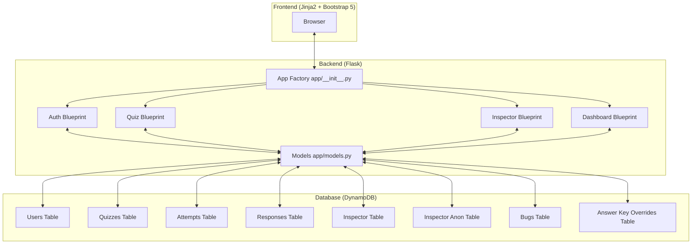

# Software Architecture - Phishing Awareness Training

## System Overview
The Phishing Awareness Training Application is a serverless Flask web application deployed on AWS.



## Data Models (Entity Relationships)
The application uses **DynamoDB** as its primary NoSQL database. Logic for data access is centralized in `app/models.py`.

```mermaid
erDiagram
    USER ||--o{ ATTEMPT : completes
    QUIZ ||--o{ ATTEMPT : of
    ATTEMPT ||--o{ RESPONSE : contains
    USER ||--o{ INSPECTOR_ATTEMPT : submits
    USER ||--o{ BUG_REPORT : reports
    
    USER {
        string username PK
        string email
        string password_hash
        string class_name
        string academic_year
        string major
        string role ("student"|"instructor"|"admin")
    }
    
    QUIZ {
        string quiz_id PK
        string title
        string description
        list questions
        string video_url
    }
    
    ATTEMPT {
        string username PK, FK
        string quiz_id PK, FK
        number score
        number total
        datetime completed_at
    }
    
    RESPONSE {
        string username_quiz_id PK, FK
        string question_id PK, FK
        string selected_answer_id
        boolean is_correct
    }
    
    BUG_REPORT {
        string bug_id PK
        string username FK
        string submitted_at
        string description
        string page_url
        string status
    }
```

## Backend Architecture (Flask)
The app uses the Flask Application Factory pattern (`app/__init__.py`). It is adapted for AWS Lambda using the `mangum` adapter (`lambda_handler.py`).

### Blueprints
- **`app/auth`**: Manages user registration, login, and sessions using `Flask-Login`.
- **`app/quiz`**: Handles quiz listing, taking quizzes, and score history.
- **`app/inspector`**: A tool for analyzing `.eml` files. It extracts email headers, HTML/text bodies, links, and **attachments** for user analysis.
    - **Parsing**: Supports both standard MIME multipart EML files and custom JSON-formatted email samples.
    - **Attachments**: Extracts metadata (filename, MIME type, size, disposition) from standard `Content-Disposition: attachment` parts and JSON `attachments` arrays.
    - **Placeholders**: Includes a **`_clean_placeholders`** helper to replace template strings (e.g., `{{.FirstName}}`, `{{.URL}}`) with generic, realistic values.
- **`app/dashboard`**: Provides administrative statistics, cohort-level analytics, an **Answer Key & Troubleshoot** view for ground-truth verification, management of user-submitted bug reports, and a comprehensive **User Management** interface. It also includes logic for calculating **Signal Identification Rates** to identify which phishing tactics are most misunderstood. The answer key editor (`POST /dashboard/inspector/answer-key/edit` and `POST /dashboard/inspector/answer-key/reset`) allows admins to override any email's classification and signals live via DynamoDB without a code deployment.

## Security Features
- **Authentication**: Password hashing with `Werkzeug`.
- **CSRF Protection**: `Flask-WTF` for secure form submission.
- **EML Sandbox**: HTML previews of phishing emails are rendered in an `<iframe>` with restricted permissions.
