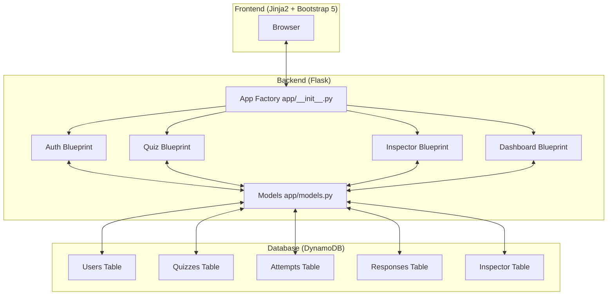
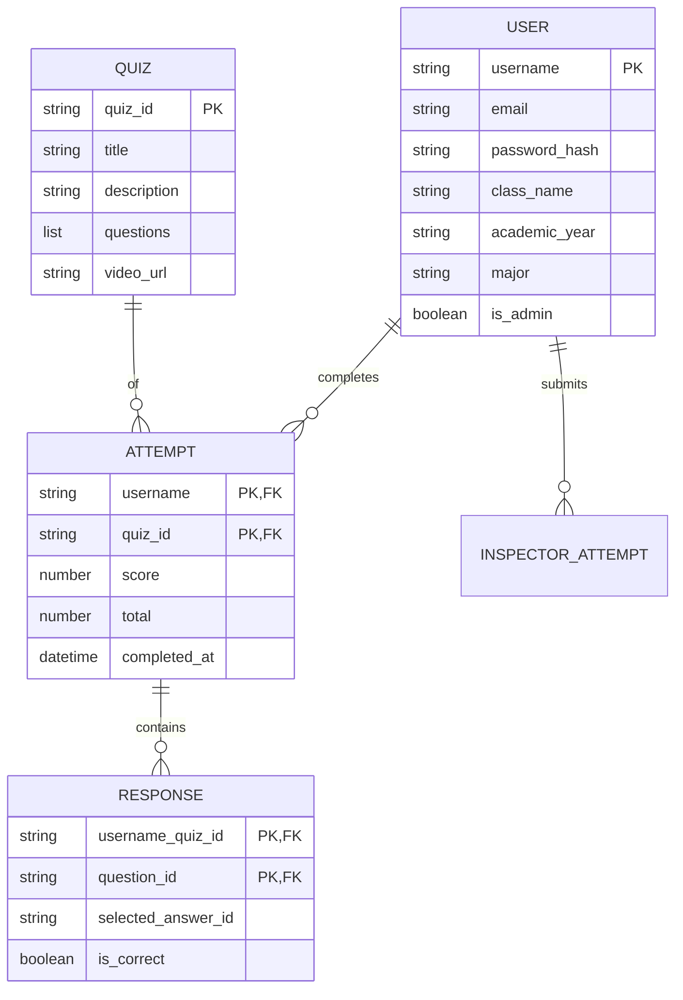

# Software Architecture - Phishing Awareness Training

## System Overview
The Phishing Awareness Training Application is a serverless Flask web application deployed on AWS.

## Data Models (Entity Relationships)
The application uses **DynamoDB** as its primary NoSQL database. Logic for data access is centralized in `app/models.py`.

## Backend Architecture (Flask)
The app uses the Flask Application Factory pattern (`app/__init__.py`). It is adapted for AWS Lambda using the `mangum` adapter (`lambda_handler.py`).

### Blueprints
- **`app/auth`**: Manages user registration, login, and sessions using `Flask-Login`.
- **`app/quiz`**: Handles quiz listing, taking quizzes, and score history.
- **`app/inspector`**: A standalone tool for parsing and analyzing `.eml` files using the Python `email` library.
- **`app/dashboard`**: Provides administrative statistics, charts (Chart.js), and cohort-level analytics.

## Security Features
- **Authentication**: Password hashing with `Werkzeug`.
- **CSRF Protection**: `Flask-WTF` for secure form submission.
- **EML Sandbox**: HTML previews of phishing emails are rendered in an `<iframe>` with restricted permissions.
