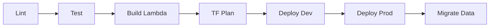

# CI/CD Pipeline - Phishing Awareness Training

## GitLab CI/CD Structure
The Phishing Awareness Training Application uses **GitLab CI** for automated quality checks and infrastructure management.

## Pipeline Stages
1. **`lint`**: Code quality check (`flake8`) and EML realism validation (`make validate-eml`).
2. **`test`**: Runs unit and integration tests (`pytest` and `moto`).
3. **`build`**: Packages the Lambda application into `lambda.zip` (`scripts/build_lambda.sh`).
4. **`plan`**: Runs `terraform plan` to preview infrastructure changes.
5. **`deploy`**:
    - **`deploy_dev`**: Automatic deployment to `dev` environment.
    - **`deploy_prod`**: Manual deployment trigger for the `prod` environment.
6. **`migrate`**: Optional data migrations (`migrate_dynamodb.py`, `migrate_s3.sh`).
7. **`destroy`**: Manual stage for tearing down infrastructure (`terraform destroy`).

## GitLab CI/CD Variables
Set these variables in GitLab settings (Settings → CI/CD → Variables):

| Variable | Type | Description |
|----------|------|-------------|
| `AWS_ACCESS_KEY_ID` | Variable | AWS access key for deployment. |
| `AWS_SECRET_ACCESS_KEY` | Masked | AWS secret key for deployment. |
| `AWS_DEFAULT_REGION` | Variable | Target region (e.g., `eu-west-3`). |
| `TF_ENV` | Variable | Target environment (`dev`, `prod`). |
| `TF_VAR_secret_key` | Masked | Flask `SECRET_KEY` (Sensitive). |
| `TF_VAR_app_name` | Variable | App prefix (default: `phishing-app`). |
| `SKIP_SEED` | Variable | Set to `true` to skip seeding. |

## Branch Strategy
- **`main`**: The production-ready branch. Every commit triggers a full `dev` pipeline.
- **`Tags`**: Can be used to trigger production releases.

---
*Generated by Gemini CLI `software-project-documenter` skill.*
