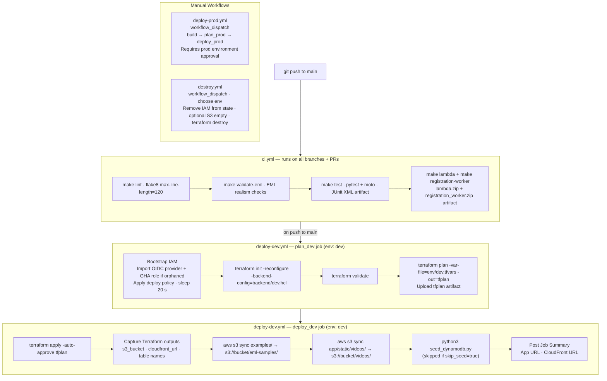

# CI/CD Pipeline — Phishing Awareness Training


The Phishing Awareness Training Application uses **GitHub Actions** for all CI/CD automation. App workflows stay under `.github/workflows/`; Terraform steps run against `phishing-platform-infra/terraform/` (and the deploy/destroy workflows can be copied into the dedicated infra repo if split).

---

## Workflows Overview

| Workflow file | Trigger | Purpose |
|---|---|---|
| `ci.yml` | Every push + PR to `main` | Lint, EML validation, tests, Lambda build |
| `deploy-dev.yml` | Push to `main` | Bootstrap IAM → Terraform plan/apply → sync assets → seed DynamoDB |
| `deploy-prod.yml` | `workflow_dispatch` only | Same build/plan/apply flow targeting the `prod` environment |
| `destroy.yml` | `workflow_dispatch` only | Tear down all infrastructure for a chosen environment |

---

## OIDC Authentication (No Static AWS Keys)

GitHub Actions assumes the deploy IAM role via **OIDC** (`sts:AssumeRoleWithWebIdentity`). No long-lived AWS credentials are stored as GitHub secrets.

```
GitHub OIDC token  →  AWS STS  →  phishing-app-{env}-github-actions-deploy role
```

The OIDC provider (`token.actions.githubusercontent.com`) and the trust policy are managed by Terraform (`phishing-platform-infra/terraform/github_actions_oidc.tf`). The trust condition is scoped to the specific repository.

---

## Full Pipeline Flow (Push to `main`)



---

## Required GitHub Secrets

Set these at **Settings → Secrets and variables → Actions → New repository secret**:

| Secret | Description |
|---|---|
| `AWS_DEPLOY_ROLE_ARN` | IAM role ARN — output from `terraform output github_actions_deploy_role_arn` |
| `TF_VAR_SECRET_KEY` | Flask `SECRET_KEY` — generate with `python3 -c "import secrets; print(secrets.token_hex(32))"` |

No `AWS_ACCESS_KEY_ID` or `AWS_SECRET_ACCESS_KEY` — OIDC is used instead.

---

## Required GitHub Environments

Create both environments at **Settings → Environments**:

| Environment | Configuration |
|---|---|
| `dev` | No approval required — auto-deploys on push to `main` |
| `prod` | Require manual approval before deployment runs |

Each environment inherits the repository-level secrets above.

---

## `workflow_dispatch` Inputs

Both `deploy-dev.yml` and `deploy-prod.yml` accept a `skip_seed` boolean input (default: `false`). Set it to `true` on manual dispatches to skip the `seed_dynamodb.py` step when the database is already seeded.

---

## Branch Strategy

| Branch | Behaviour |
|---|---|
| `main` | Every push triggers the full CI + dev deploy pipeline automatically |
| Feature branches | CI only (lint + test + build) — no deploy |
| Production | Manual `workflow_dispatch` on `deploy-prod.yml` with prod environment approval |

---

## Claude Workflows (Supplementary)

Two additional workflows support AI-assisted development and are not part of the deploy pipeline:

| Workflow | Trigger |
|---|---|
| `claude.yml` | `@claude` mention in any issue or PR comment |
| `claude-code-review.yml` | Auto-reviews every opened or updated PR |
