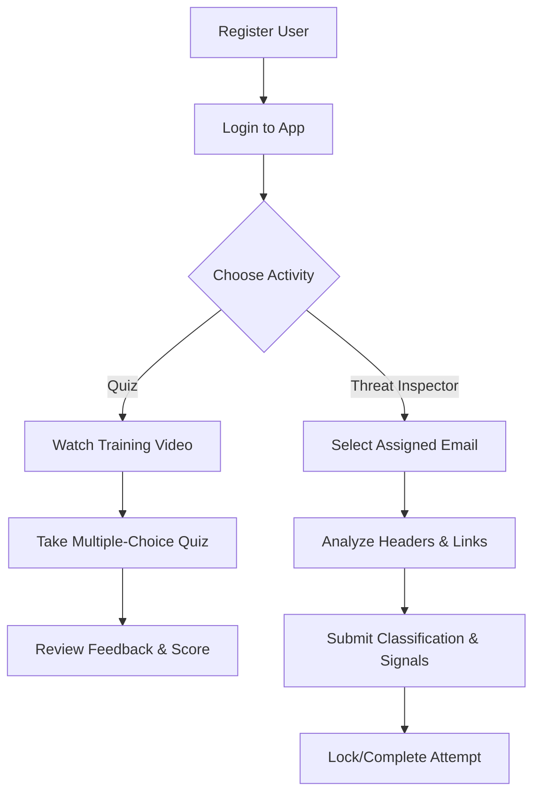

# Student User Guide - Phishing Awareness Training

## Introduction
The Phishing Awareness Training Application is designed to help you recognize and defend against phishing attacks.

## 🎓 Student Learning Path

## 🔑 1. Getting Started
1. **Access the App**: Open the training URL in your browser.
2. **Register**: Click **Register**, fill in your details (username, email, password, and cohort info), and submit.
3. **Login**: Use your credentials to log in to the student dashboard.

## 📝 2. Phishing Quizzes
Quizzes test your knowledge of various phishing techniques (e.g., URL analysis, spoofing, urgency tactics).
1. **Select a Quiz**: Browse the list of available quizzes on your dashboard.
2. **Watch the Video**: Each quiz begins with a training video. Watch it carefully for clues and techniques.
3. **Take the Quiz**: Answer the four questions. You'll receive immediate feedback after each question.
4. **Review Results**: After finishing, you'll see your score and a summary of your performance.
5. **History**: You can view your quiz history and scores from the **My Quizzes** page.

## 🔍 3. Email Threat Inspector
The Email Threat Inspector is a powerful tool to analyze real-world phishing and spam emails.
1. **Navigate to Inspector**: Click **Email Threat Inspector** in the sidebar.
2. **Select an Email**: You'll be assigned a set of emails to analyze.
3. **Analyze the Email**:
    - **Overview**: Check the sender, recipient, and subject.
    - **Headers**: Examine technical details like `Return-Path`, `Reply-To`, and authentication results (SPF/DKIM).
    - **HTML Preview**: View the email as it would appear in an inbox (safely sandboxed).
    - **Links**: Inspect all extracted URLs for look-alike domains or suspicious destinations.
    - **Attachments**: Check for malicious file types and names.
4. **Classify the Threat**: Select whether the email is **Phishing**, **Spam**, or **Legit**.
5. **Identify Signals**: Choose the phishing signals you've identified (e.g., Impersonation, Urgency, Typosquatting).
6. **Submit**: Save your analysis. You can only analyze each email once.

## 💡 4. Phishing Signals to Watch For
- **Impersonation**: Pretending to be a trusted person or brand.
- **Urgency**: Creating a sense of fear or time pressure.
- **Typosquatting/Punycode**: Using look-alike domains.
- **Spoofing**: Faking the `From` address.
- **Social Engineering**: Manipulating you into revealing sensitive information.
- **Malicious Attachment**: Including dangerous files.

## 🏆 5. Training Journey & Ranks
Stay motivated by tracking your progress and leveling up:
- **Progress Bar**: See how many of the available quizzes you've completed.
- **Ranks**: Earn badges based on your performance:
    - **Novice**: Just starting out.
    - **Trainee**: Making progress.
    - **Defender**: Consistently identifying threats.
    - **Cyber Sentinel**: Mastery of phishing awareness (90%+ average score).

## 🐛 6. Reporting Bugs
If you encounter any technical issues or errors:
1. **Click 'Report Bug'**: Located in the top navigation bar next to Logout.
2. **Describe the Issue**: Provide a brief description of what went wrong.
3. **Automatic Context**: Your username and the current page URL will be automatically sent with your report to help administrators troubleshoot.

---
*Generated by Gemini CLI `software-project-documenter` skill.*
