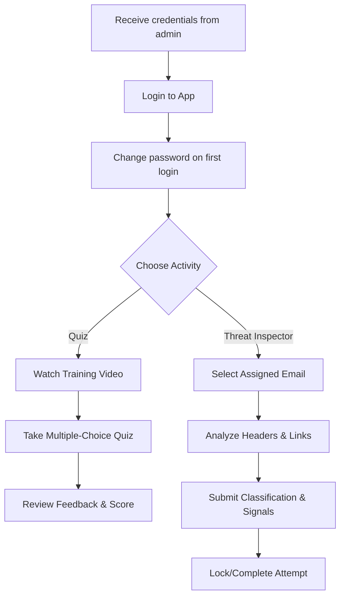

# Student User Guide — Phishing Awareness Training

## Introduction

The Phishing Awareness Training Application helps you recognise and defend against phishing attacks through two complementary activities: knowledge quizzes and a hands-on Email Threat Inspector.

> **Note:** There is no self-registration. Your account is created by your instructor before the course starts. You will receive your username and a temporary password by email or in class.

---

## 🎓 Student Learning Path

---

## 🔑 1. Getting Started

### 1.1 Login

1. Open the training URL in your browser.
2. Enter the **username** and **password** provided by your instructor.
3. Click **Login**.

---

![[Pasted image 20260227175254.png]]

---

### 1.2 Change Your Password (Recommended on First Login)

Your instructor created your account with a temporary password. You should change it immediately.

1. After logging in, click your username in the top-right corner and select **Change Password** (or navigate to **Settings → Change Password**).
2. Enter your current (temporary) password.
3. Enter and confirm your new password.
4. Click **Save**.

---
![[Pasted image 20260227175356.png]]

---

### 1.3 Dashboard

After logging in you land on your personal dashboard, which shows:
- Quizzes available and your progress
- Your current rank badge
- A link to the Email Threat Inspector

---
![[Pasted image 20260227175448.png]]

---

## 📝 2. Phishing Quizzes

Quizzes test your knowledge of phishing techniques such as URL analysis, spoofing, and urgency tactics.

### 2.1 Select a Quiz

1. From the dashboard (or **My Quizzes** in the sidebar), browse the list of available quizzes.
2. Click the quiz you want to take.

---
![[Pasted image 20260227175510.png]]

---

### 2.2 Watch the Training Video

Each quiz is gated behind a short training video that introduces the topic. You must watch it before the quiz unlocks.

1. Click **Watch Video**.
2. Watch the full video — the quiz button activates once you reach the end.

---
![[Pasted image 20260227175531.png]]

---

### 2.3 Take the Quiz

1. Click **Start Quiz** after the video.
2. Answer each multiple-choice question and confirm your choice.
3. You receive immediate per-question feedback.

---
> **📸 Screenshot placeholder**
> *Insert screenshot of a Quiz question in progress here*

---

### 2.4 Review Results

After the last question you see your score, a breakdown per question, and the correct answers.

- You may only attempt each quiz **once**.
- Visit **My Quizzes** to see your full history and scores.

---
> **📸 Screenshot placeholder**
> *Insert screenshot of the Quiz results / score summary page here*

---

## 🔍 3. Email Threat Inspector

The Email Threat Inspector lets you analyse real-world phishing and spam emails in a safe, sandboxed environment.

### 3.1 Open the Inspector

Click **Email Threat Inspector** in the sidebar.

You are assigned a personal pool of up to **8 emails** (a mix of spam and phishing samples).

---
![[Pasted image 20260227175602.png]]

---

### 3.2 Analyse an Email

Click on an email in your list to open the analysis view. Use the tabs to examine the email from different angles:

| Tab | What to look for |
|-----|-----------------|
| **Overview** | Sender, recipient, subject, date |
| **Headers** | `Return-Path`, `Reply-To`, SPF/DKIM/DMARC results |
| **HTML Preview** | How the email looks in an inbox (safely sandboxed) |
| **Links** | Extracted URLs — look for look-alike or punycode domains |
| **Attachments** | Filename, size, MIME type — flag dangerous types (`.exe`, `.zip`, `.html`) or double extensions (`.pdf.exe`) |

---
![[Pasted image 20260227175719.png]]

---

### 3.3 Classify the Threat and Identify Signals

1. At the bottom of the analysis view, select the **classification**: **Phishing**, **Spam**, or **Legit**.
2. If you selected **Phishing**, tick all the **signals** you identified (see §4 for the full list).
3. Click **Submit**.

> Each email can only be submitted **once** — your answer is final.

---
![[Pasted image 20260227175645.png]]

---

### 3.4 Completion

Once you have submitted all 8 emails your Inspector access is locked. You will see a completion page confirming that all submissions are recorded.

---
> **📸 Screenshot placeholder**
> *Insert screenshot of the Completion / locked page after all 8 emails are submitted here*

---

## 💡 4. Phishing Signals to Watch For

| Signal | Description |
|--------|-------------|
| **Impersonation** | Pretending to be a trusted person or brand |
| **Urgency** | Creating fear or time pressure to provoke hasty action |
| **Typosquatting / Punycode** | Using look-alike or unicode domains (e.g. `paypaI.com`) |
| **Spoofing** | Faking the `From` address |
| **Social Engineering** | Manipulating you into revealing sensitive information |
| **External Domain** | Links pointing to a domain unrelated to the claimed sender |
| **Fake Invoice / Fake Login** | Fraudulent documents or credential-harvesting pages |
| **Attachment** | Dangerous file attachment |
| **Side Channel** | Redirecting communication off the main platform (WhatsApp, SMS) |

---

## 🏆 5. Training Journey & Ranks

Track your progress and earn ranks as you complete quizzes:

| Rank | Criteria |
|------|----------|
| **Novice** | Just starting out |
| **Trainee** | Making progress |
| **Defender** | Consistently identifying threats |
| **Cyber Sentinel** | 90%+ average score — mastery of phishing awareness |

The progress bar on your dashboard shows how many of the available quizzes you have completed.

---

## 🐛 6. Reporting Bugs

If you encounter a technical issue:

1. Click **Report Bug** in the top navigation bar (next to Logout).
2. Describe what went wrong.
3. Click **Submit** — your username and the current page URL are attached automatically to help the admin troubleshoot.

---
> **📸 Screenshot placeholder**
> *Insert screenshot of the Bug report form here*

---
